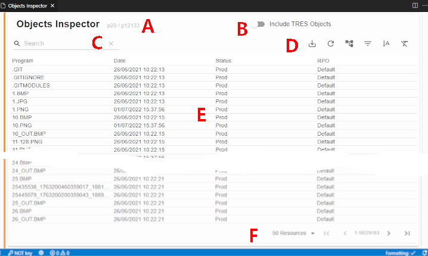

# TDS: Inspeção do RPO

> Requisitos

- servidor/ambiente conectado
- usuário autenticado (se requerido)

## Servidores anteriores ao Harpia (20.0.0.0)

### Inspetor de Objetos do RPO

Permite visualizar os arquivos que fazem parte do _RPO_. Acione o menu de contexto sobre o servidor e acione `Objects Inspector` ou acione`CTRL + SHIFT + P` e execute `TOTVS: Objects Inspector`.

Lhe será apresentado uma lista com os arquivos do _RPO_ e pode filtrar a lista, preenchendo um padrão de busca em `Filter`.

#### Inspetor de Funções do RPO

Permite visualizar os arquivos que fazem parte do _RPO_. Acione o menu de contexto sobre o servidor e acione `Functions Inspector` ou acione`CTRL + SHIFT + P` e execute `TOTVS: Functions Inspector`.

Lhe será apresentado uma lista com as funções do _RPO_ e pode filtrar a lista, preenchendo um padrão de busca em `Filter`.

## Servidores Harpia (20.0.0.0) ou superiores (#harpia)

### Inspetor de Objetos do RPO

Permite visualizar os arquivos que fazem parte do _RPO_. Acione o menu de contexto sobre o servidor e acione `Objects Inspector` ou acione`CTRL + SHIFT + P` e execute `TOTVS: Objects Inspector`.

### Inspetor de Funções do RPO

Permite visualizar os arquivos que fazem parte do _RPO_. Acione o menu de contexto sobre o servidor e acione `Functions Inspector` ou acione`CTRL + SHIFT + P` e execute `TOTVS: Functions Inspector`.

### Operações

Ambos os inspetores permitem as mesmas operações.

|     | Descrição                                                                                                      |
| --- | -------------------------------------------------------------------------------------------------------------- |
| A   | Titulo do inspetor em uso e identificação do servidor/ambiente                                                 |
| B   | Filtro padrão para limitar número de elementos                                                                 |
| C   | Filtro rápido, aplicado em todas as colunas                                                                    |
| D   | Acionamento de agrupamento, filtro por coluna, exportação dos dados em arquivo texto e _reset_ de configuração |
| E   | Informações obtidos nos _RPO´s_                                                                                |
| F   | Elementos por página e navegação                                                                               |

### `Inspetor de Funções`

---

| Coluna             | Descrição              |
| ------------------ | ---------------------- |
| Objeto             | Nome da função         |
| Programa           | Nome do arquivo fonte  |
| Linha              | Linha do arquivo fonte |
| Status1 | Status do fonte        |
| RPO2    | RPO de origem          |

### `Inspetor de Objetos`

---

| Coluna             | Descrição          |
| ------------------ | ------------------ |
| Objeto             | Nome do recurso    |
| Data               | Data de compilação |
| Status1 | Status do fonte    |
| RPO2    | RPO de origem      |

### Notas

1. _Status_: Indica se este recurso foi compilado:

- `Dev`, recurso compilado com token de compilação de desenvolvimento
- `Prod`, recurso compilado com token de compilação de produção
- `NoAuth`, recurso compilado sem token de compilação

2. _RPO_: Indica o repositório de objetos onde encontra-se o recurso, podendo ser:

- `Default`, _RPO_ indicado na chave `sourcePath`
- `TLPP`, _RPO_ de suporte a TLPP
- `Custom`, _RPO_ do usuário indicado na chave `rpoCustom`

Consulte [RPO Múltiplos](https://tdn.totvs.com/display/tec/RPOs+Multiplos).
